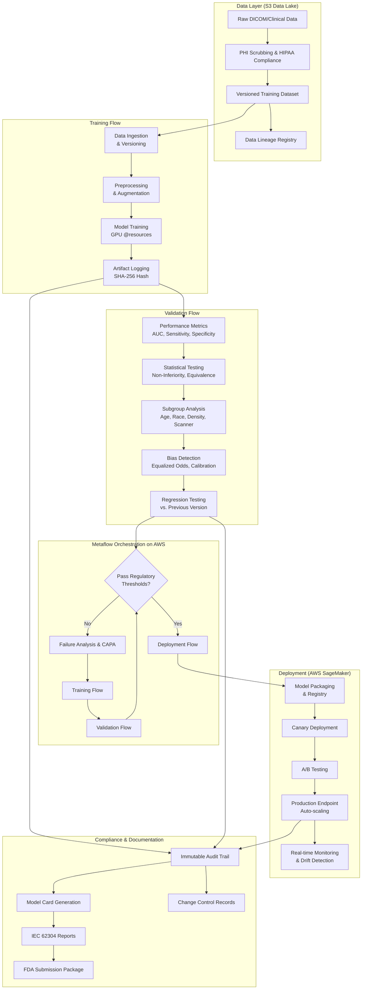
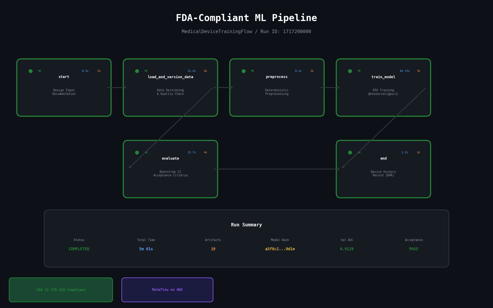
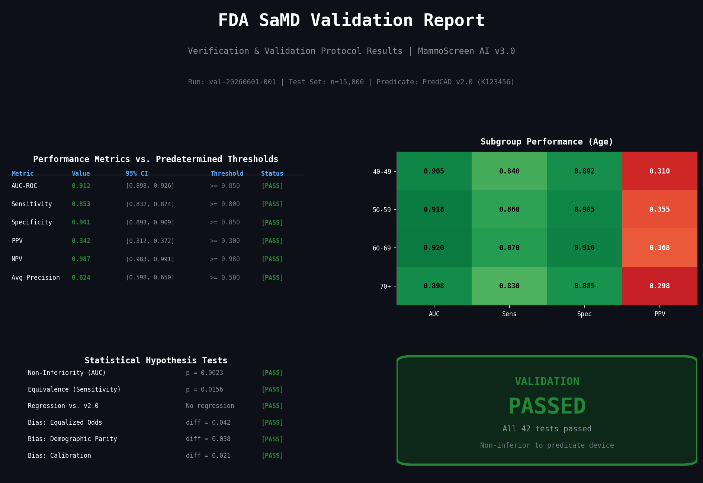
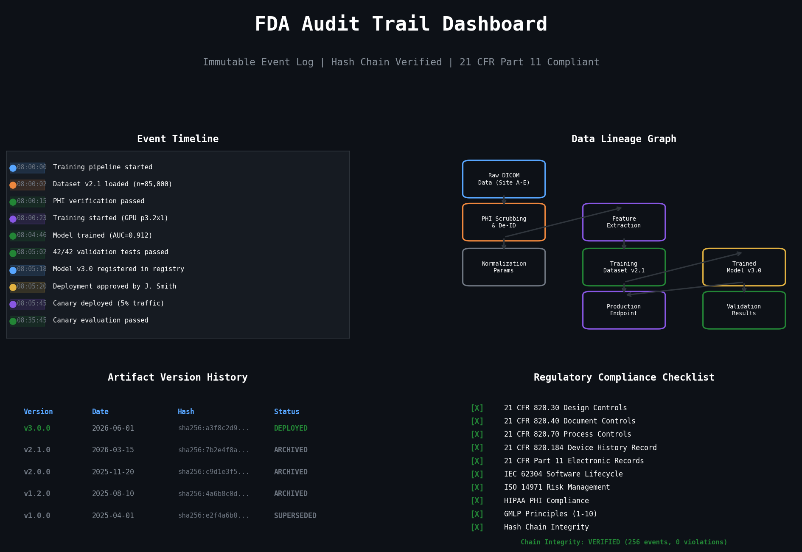

# FDA-Compliant ML Pipeline for Medical Device Software (SaMD) on AWS


> A production-grade, regulatory-ready ML pipeline for developing and deploying AI/ML-based Software as a Medical Device (SaMD), built on Metaflow and AWS. Designed to satisfy FDA 21 CFR Part 820 Quality System Regulation, IEC 62304 Software Lifecycle, and the FDA's Good Machine Learning Practice (GMLP) principles.

---

## Motivation

Machine learning models embedded in medical devices face a unique engineering challenge: **they must meet the same rigorous quality, traceability, and validation standards as any other medical device component**, while also addressing ML-specific risks such as dataset shift, bias, and non-determinism.

The FDA's evolving regulatory framework for AI/ML-based SaMD requires:

- **Reproducibility**: Every training run, dataset version, and hyperparameter choice must be fully traceable.
- **Predetermined Change Control Plans**: Model updates must follow validated protocols with statistical rigor.
- **Good Machine Learning Practice (GMLP)**: Training data quality, bias mitigation, and real-world performance monitoring are mandatory.
- **21 CFR Part 820 Compliance**: Design controls, verification & validation, document control, and CAPA processes must be woven into the ML lifecycle.
- **IEC 62304 Software Lifecycle**: Software development plans, architecture documentation, unit/integration testing, and risk management must be maintained for all software of Class A/B/C safety classification.

This pipeline provides a **complete, auditable ML lifecycle** that satisfies these requirements while remaining practical for real-world medical AI development.

---

## Architecture



---

## Pipeline Visualization

### Pipeline Overview


*Metaflow DAG visualization showing the full training-validation-deployment pipeline with step-level timing, artifact counts, and status indicators.*

### Validation Report


*FDA-style validation report showing performance metrics against predetermined thresholds, subgroup analysis heatmap, and statistical test results with pass/fail status.*

### Audit Trail


*Immutable audit trail dashboard showing chronological events, data lineage graph, artifact version history, and regulatory compliance checklist.*

---

## FDA Compliance Features

| Regulatory Requirement | Implementation | Module |
|---|---|---|
| **21 CFR 820.30** Design Controls | Predetermined performance thresholds, V&V protocols | `validation_flow.py`, `regulatory_report.py` |
| **21 CFR 820.184** Device History Record | Immutable audit trail with SHA-256 artifact hashing | `audit_trail.py` |
| **21 CFR 820.40** Document Controls | Version-controlled regulatory documents with approval tracking | `change_control.py` |
| **21 CFR 820.90** CAPA | Automated failure mode analysis and regression testing | `regression_testing.py` |
| **IEC 62304** Software Lifecycle | Full lifecycle documentation, risk analysis, V&V | `regulatory_report.py` |
| **GMLP Principle 1** Multi-disciplinary expertise | Structured model cards with clinical context | `model_card.py` |
| **GMLP Principle 3** Clinical study design | Statistical non-inferiority/equivalence testing | `statistical_tests.py` |
| **GMLP Principle 5** Reference datasets | Versioned data lake with lineage tracking | `s3_data_lake.py`, `data_governance.py` |
| **GMLP Principle 7** Focus on performance | Subgroup analysis across demographics | `bias_detection.py` |
| **GMLP Principle 9** Monitoring | Real-time drift detection and performance monitoring | `sagemaker_deploy.py` |
| **HIPAA** Privacy Rule | PHI detection, scrubbing, access control, consent management | `data_governance.py` |

---

## Regulatory Standards Covered

### FDA 21 CFR Part 820 - Quality System Regulation
The pipeline implements design controls (820.30), document controls (820.40), production and process controls (820.70), and the device history record (820.184) as automated, auditable processes within the ML lifecycle.

### IEC 62304 - Medical Device Software Lifecycle
Software development plan, architecture documentation, detailed design, unit testing, integration testing, and system testing are all generated and maintained as part of the pipeline's documentation module.

### Good Machine Learning Practice (GMLP)
All ten GMLP guiding principles identified by the FDA, Health Canada, and MHRA are addressed through structured validation, bias detection, data governance, and monitoring capabilities.

### Predetermined Change Control Plan
The pipeline supports the FDA's proposed framework for modifications to AI/ML-based SaMD through automated regression testing, statistical significance analysis, and change impact assessment.

---

## Quick Start

```bash
# Install dependencies
pip install -r requirements.txt

# Configure AWS credentials
aws configure

# Run training pipeline
python scripts/run_training.py --config configs/training_config.yaml

# Run validation pipeline
python scripts/run_validation.py --config configs/validation_config.yaml

# Generate FDA submission package
python scripts/generate_submission.py --run-id <metaflow-run-id> --output ./submission/
```

---

## Project Structure

```
fda-compliant-ml-pipeline/
├── src/
│   ├── pipeline/
│   │   ├── training_flow.py        # Metaflow training pipeline
│   │   ├── validation_flow.py      # Metaflow validation pipeline
│   │   └── deployment_flow.py      # Metaflow deployment pipeline
│   ├── compliance/
│   │   ├── audit_trail.py          # Immutable FDA audit trail
│   │   ├── data_governance.py      # HIPAA & data governance
│   │   └── model_card.py           # FDA-style model card generation
│   ├── validation/
│   │   ├── statistical_tests.py    # Non-inferiority, equivalence testing
│   │   ├── bias_detection.py       # Fairness & bias analysis
│   │   └── regression_testing.py   # Model regression testing
│   ├── documentation/
│   │   ├── regulatory_report.py    # IEC 62304 report generation
│   │   └── change_control.py       # Change control management
│   └── aws/
│       ├── sagemaker_deploy.py     # SageMaker deployment utilities
│       └── s3_data_lake.py         # S3 data lake management
├── configs/
│   ├── training_config.yaml
│   ├── validation_config.yaml
│   └── deployment_config.yaml
├── scripts/
│   ├── run_training.py
│   ├── run_validation.py
│   └── generate_submission.py
├── tests/
│   └── test_compliance.py
├── assets/screenshots/
│   └── generate_screenshots.py
├── requirements.txt
└── .gitignore
```

---

## Key Design Decisions

1. **Metaflow for Orchestration**: Provides native artifact versioning, step-level reproducibility, and seamless AWS integration -- critical for regulatory traceability.
2. **SHA-256 Artifact Hashing**: Every model artifact, dataset, and configuration is cryptographically hashed and logged to ensure tamper-proof audit trails.
3. **Statistical Rigor**: Validation uses formal hypothesis testing (non-inferiority, equivalence) rather than ad-hoc metric comparisons, as required for regulatory submissions.
4. **Subgroup-First Validation**: Performance is evaluated across all clinically relevant subgroups before overall metrics, preventing hidden bias.
5. **Immutable Audit Trail**: All pipeline actions are logged to an append-only store with cryptographic integrity verification.

---

## License

This project is provided for portfolio demonstration purposes. The regulatory compliance patterns demonstrated here reflect real-world FDA SaMD requirements but should be validated by a regulatory affairs team before use in an actual medical device submission.
